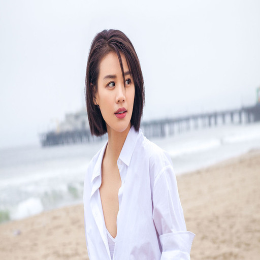
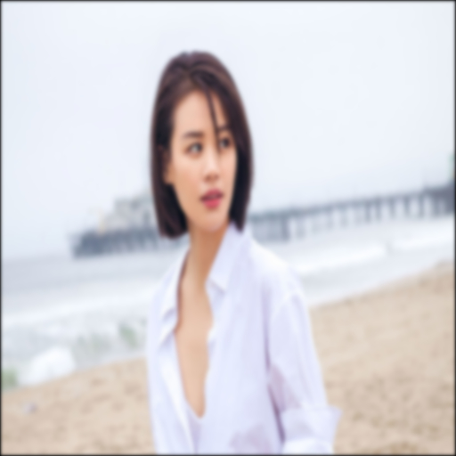
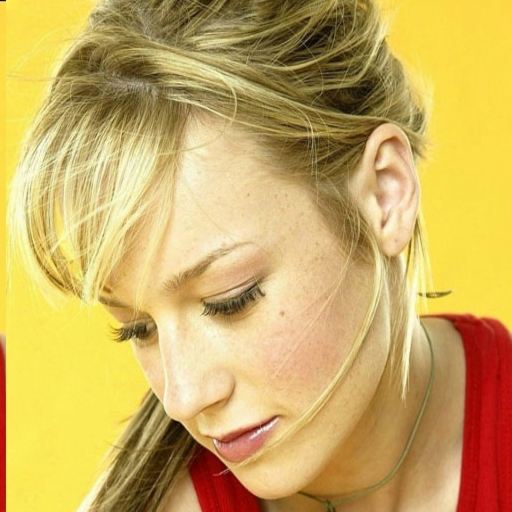
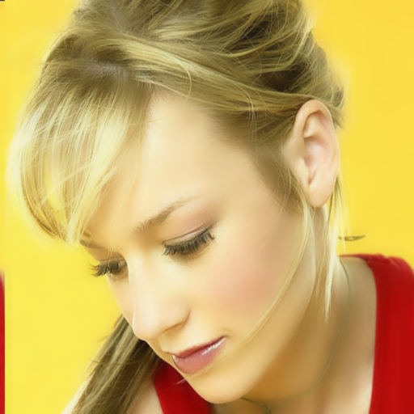
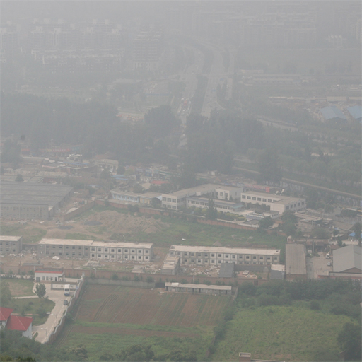
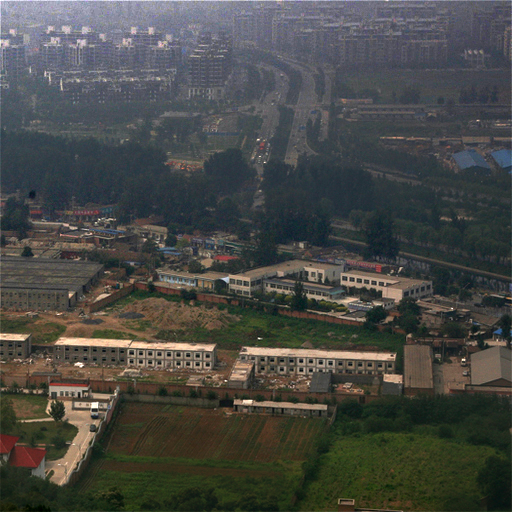
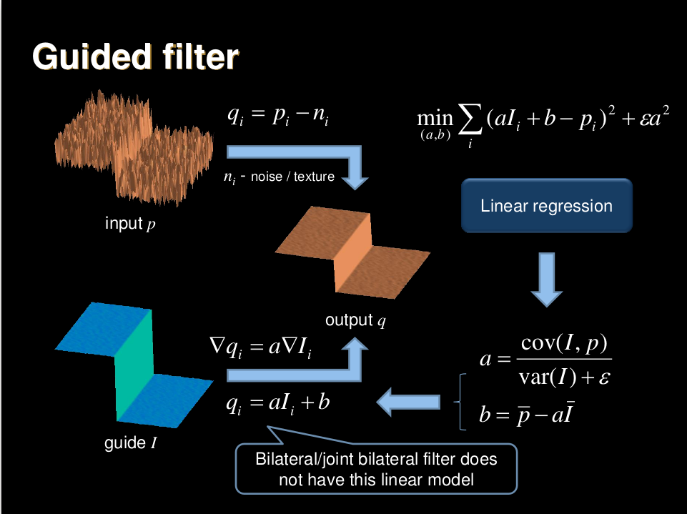

Beyond Filter
====

How use modern deep learning instead of tradition image digit process ?
----

Gaussian Filter
----

|  |  |
| -------------------------- | ---------------------------- |
|                            | Gaussian 3x3 Filter 10 times |

**Command**

 `python gauss.py images/gauss_girl.jpg` 

**Crazy !**

You can filter 100000 times in 5 seconds via GTX 1080 if you like !

Guided Filter
----
|  |           |
| --------------------------- | -------------------------------------- |
|                             | Guided Filter: Radius = 10, eps = 0.01 |

**Command**

 `python guided.py images/guided_girl.jpg`

Image Enhance
----

|  |          |
| ----------------------- | -------------------------------------- |
|                         | Guided Filter: Radius = 10, eps = 0.01 |

**Command**

 `python guided.py images/enhance.jpg`

## Haze Filter

|  |     |
| -------------------- | ------------------------------ |
|                      | Remove Haze Filter: Radius = 5 |

**Command**

`python dehaze.py images/haze.jpg` 

Requirements
----

- Python 3

- Pytorch 0.4.0

- Torchvision 0.2.1

- Pillow

Reference
----

[**Guided Image Filtering**](http://kaiminghe.com/eccv10/)

License
----

BeyondFilter is released under the [Apache 2.0 license]

Chinese Document
----
**超越滤波.**

